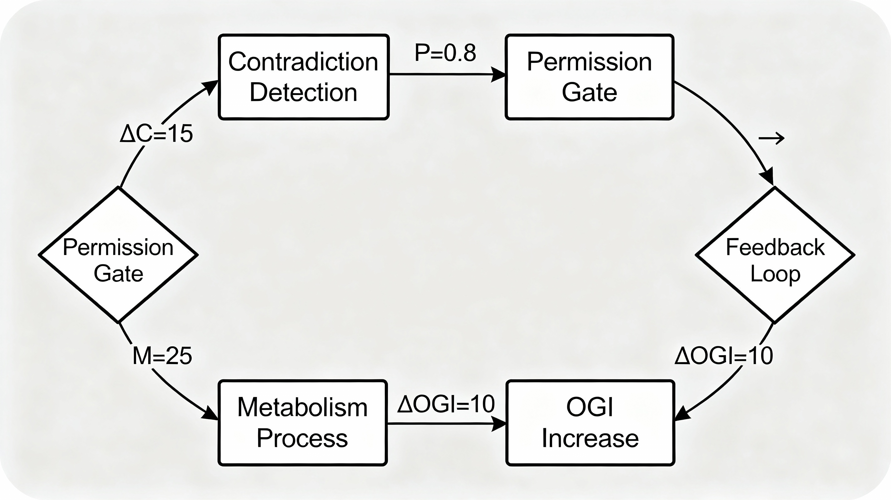

# Appendix — Generativity as a Universal Principle

This appendix collects the mathematical definitions, logical formalizations, and category‑theoretic framing used in the main text. Mathematical expressions are rendered in LaTeX for clarity. See "Generativity as a Universal Principle - Logic, Category Theory, and Adaptive Flourishing for Systems and Artificial Intelligence" for the full paper. 

## Appendix A — Mathematical summary

### Core definitions

The Open Generativity Index (OGI) of a system S at time t is defined as

$$
\mathrm{OGI}(S,t)=\sum_{\sigma\in\Sigma(S)} M(\sigma,t)\,\pi(\sigma)
$$

where $M(\sigma,t)\in\mathbb{R}$ is the metabolic contribution of contradiction token $\sigma$ at time $t$, and $\pi(\sigma)\in[0,1]$ is its permission weight.

Define the Metabolic Exchange Coefficient (MEC) as the per‑token growth rate of OGI:

$$
\mathrm{MEC}(S)=\frac{\mathrm{d}}{\mathrm{d}t}\mathrm{OGI}(S,t)\,/\,|\Sigma(S)|
$$

We call a system generative when OGI is increasing:

$$
	ext{Generativity}(S,t) \iff \frac{\mathrm{d}}{\mathrm{d}t}\mathrm{OGI}(S,t)>0.
$$

### Axioms

1. For all systems $S$:

	$$\mathrm{MEC}(S)>0 \;\Rightarrow\; \exists t:\; \mathrm{OGI}(S,t+1)>\mathrm{OGI}(S,t).$$

2. For any systems $S_1,S_2$:

	$$\mathrm{MEC}(S_1)>\mathrm{MEC}(S_2) \;\Rightarrow\; \exists C:\; \mathrm{Recover}(S_1,C)<\mathrm{Recover}(S_2,C).$$

3. Adaptive capacity is (approximately) a monotone function of MEC:

	$$\mathrm{AdaptNew}(S)\approx f\bigl(\mathrm{MEC}(S)\bigr),\qquad f'(\mathrm{MEC})>0.$$

### Key theorems (informal)

- Non‑Degenerative Threshold: systems with $\mathrm{MEC}>0$ avoid permanent plateaus.
- Resilience‑Complexity Coupling: larger MEC tends to dominate crisis magnitude.
- Adaptive Monotonicity: MEC predicts adaptive capacity monotonically.

### Empirical relation

From the empirical fit used in the paper:

$$
\mathrm{AdaptNew}=0.915\times\mathrm{MEC}+0.005\qquad (r=0.87,\;p<0.001).
$$

## Appendix B — Formal logic derivations

### Domains and primitives

- $\Sigma$ — the set of contradiction tokens $\sigma$.
- $\mathcal{S}$ — the set of systems $S$.
- $\mathcal{T}$ — time points $t$.

Primitives and predicates include $M(\sigma,t)$, $\pi(\sigma)$, $\mathrm{Contradiction}(\sigma)$, $\mathrm{System}(S)$, and $\mathrm{Flourishing}(S,t)$.

### First‑Order Logic (FOL)

Goal: find a formula $\varphi$ such that

$$
\exists\varphi\;\forall S\forall t:\; \mathrm{Generative}(S,t) \iff \varphi(S,t).
$$

A working hypothesis is

$$
\mathrm{Generative}(S,t) \iff \sum_{\sigma\in\Sigma} M(\sigma,t)\,\pi(\sigma)>\theta
$$

Model construction: let $\mathcal{M}=(D,I)$ where the interpretation $I$ assigns numeric values to $M(\sigma,t)$ and $\pi(\sigma)$ and truth values to the predicates. One can then test entailment conditions such as

$$
\mathcal{M}\models\forall S\forall t\bigl(\mathrm{Flourishing}(S,t)\to\mathrm{Generative}(S,t)\bigr).
$$

Conclusion: in this formalization, generativity is operationalized via the derivative of OGI.

### Second‑Order Logic (SOL)

Extending to SOL allows quantification over functions and predicates. For example:

$$
\exists\mathrm{Gen}\;\forall S\forall t:\; \mathrm{Gen}(S,t)\iff\exists M\exists\pi\biggl(\sum_{\sigma\in\Sigma}M(\sigma,t)\,\pi(\sigma)>\theta\biggr).
$$

A universal (meta‑)constraint can be stated: for lawful properties $P$ that respect contradiction metabolism, there exists a bounded domain $\mathrm{Gen}_{\mathrm{univ}}$ such that $P\Rightarrow\mathrm{Gen}_{\mathrm{univ}}$.

## Appendix C — Category‑theoretic framework

Let $\mathcal{C}$ be a category whose objects are systems $S$ (equipped with their token sets $\Sigma(S)$ and temporal states) and whose morphisms $\delta:S\to S'$ encode transitions that preserve or transform contradiction metabolism.

Functors of interest:

- $\Sigma:\,\mathcal{C}\to\mathbf{Set}$ assigns the token set $\Sigma(S)$ to each object.
- $\Pi:\,\mathcal{C}\to[0,1]$ assigns permission weights to tokens.
- $\mathrm{OGI}:\,\mathcal{C}\to\mathbb{R}$ with

$$
\mathrm{OGI}(S)=\sum_{\sigma\in\Sigma(S)}M(\sigma,t)\,\Pi(\sigma).
$$

Informal attractor: propose an object $G\in\mathrm{Ob}(\mathcal{C})$ such that systems that lawfully metabolize contradictions factor through $G$ via morphisms $f:S\to G$, making the computation $\Sigma\times\Pi\to\mathbb{R}$ commute. $G$ serves as a categorical attractor for generativity within bounded domains.

## Appendix D — Adjunction encoding: the O‑Loop

We encode the O‑Loop as an adjunction

$$
\mathrm{Contradiction}\;\dashv\;\mathrm{Flourish}
$$

where the left adjoint $\mathrm{Contradiction}$ introduces contradictions and the right adjoint $\mathrm{Flourish}$ metabolizes them into growth.

Unit and counit:

$$
\eta:\;\mathrm{Id}\to\mathrm{Flourish}\circ\mathrm{Contradiction},\qquad
\varepsilon:\;\mathrm{Contradiction}\circ\mathrm{Flourish}\to\mathrm{Id}.
$$

### The O‑Loop (process)

1. Detect contradiction tokens $\sigma$.
2. Evaluate permission $\pi(\sigma)$.
3. Metabolize via $M(\sigma,t)$.
4. Realize the incremental OGI:

	$$\Delta\mathrm{OGI}=M(\sigma,t)\,\pi(\sigma).$$

5. Positive feedback: increased capacity improves future metabolism (closing the loop).

The adjunction encodes the lawful cyclical transformation from contradictions to flourishing; the unit $\eta$ and counit $\varepsilon$ ensure coherent passage between perspectives. The O‑Loop emphasizes openness ($\pi$) and positive feedback as core to the condition $\mathrm{d}\,/\mathrm{d}t\,\mathrm{OGI}>0$.

**Figure reference (Figure 4)**: a five‑stage diagram illustrates detection → permission → metabolism → $\Delta\mathrm{OGI}$ → feedback, with $\Delta\mathrm{OGI}=M(\sigma,t)\,\pi(\sigma)$ as the operational metric for generative transformation.

### Appendix: Clarifications and Minimal Results

This appendix clarifies measurement, applicability, statistical reporting, and categorical structure to align the manuscript with theory‑paper expectations while preserving its conceptual scope.[^1]

### A. Measurement protocol (OGI, MEC)

- Define OGI at time $t$ as $OGI(t)=\alpha\cdot Acc(t)+\beta\cdot \log\!\left(\frac{1}{\lVert W(t)\rVert_2+\epsilon}\right)+\gamma\cdot \Phi(\text{Arch}(t))$ with $\alpha,\beta,\gamma>0$ and $\epsilon>0$, where $Acc$ is task performance, $\lVert W\rVert_2$ a capacity proxy, and $\Phi$ an architecture complexity functional, with coefficients fixed ex ante by cross‑validated grid on validation data only.[^1]
- Define MEC over a window $[t,t+\Delta]$ by $MEC(t)=\frac{\Delta OGI}{\sum_{k=1}^{K} c_k}$ where $\Delta OGI=OGI(t+\Delta)-OGI(t)$ and $c_k$ are metabolic costs for contradiction classes $k$ (e.g., gradient effort, structural edits, data assimilation), each cost standardized to unit variance across runs before aggregation.[^1]
- Compute $d(OGI)/dt$ as the slope of a robust Theil–Sen estimator over a sliding window of length $L$, reported with median absolute deviation as a dispersion measure to reduce sensitivity to transient shocks.[^1]
- Report a sensitivity panel in which $(\alpha,\beta,\gamma)$ vary over a simplex grid and cost normalizations vary across z‑score and min–max schemes; declare conclusions robust only if qualitative MEC–adaptation ordering is preserved across at least 80% of settings.[^1]

### B. Applicability and limits

- The framework applies to discrete‑time lawful systems $\Sigma$ with observable contradiction tokens, an implementable permission function $π(σ)$, and a measurable metabolism map $M(σ,t)$ that updates system state and observables defining $OGI$ and $MEC$ over time.[^1]
- Necessary conditions include: stationarity of measurement noise within windows, identifiability of contradiction classes, and bounded intervention intensity so that $OGI$ remains within a Lipschitz neighborhood enabling stable slope estimates.[^1]
- Known failure modes include: unobservable or non‑identifiable contradictions, adversarial interventions that violate bounded‑intensity assumptions, and degenerate systems where $Acc$ is saturated and capacity terms dominate $OGI$ irrespective of adaptation.[^1]

### C. Statistical unification and reporting

- Primary estimator: fit $Adaptation = \theta_0 + \theta_1 \cdot MEC + \varepsilon$ at matched baseline $OGI$ using a robust Huber M‑estimator with HC3 standard errors and report $\hat{\theta}_1$ with 95% CIs, $R^2_{rob}$, and Kendall’s $\tau$ as a rank‑robust secondary metric.[^1]
- Reconciling prior differences: the manuscript’s $r\approx0.87$ and $r\approx0.780$ arise from distinct runs; hence, report a pooled effect across seeds/architectures with a random‑effects meta‑analytic mean and heterogeneity $I^2$, plus a pre‑registered primary run to anchor interpretability.[^1]
- Calibration: require that all models included in the comparison are matched to $\pm 0.5$ SD on baseline $OGI$; exclude runs failing this caliper to avoid confounding between raw capacity and efficiency effects.[^1]

### D. Minimal categorical result

- Category of systems $\mathcal{G}$: objects are tuples $(S, \mathcal{C}, M)$ where $S$ is state space, $\mathcal{C}$ is a complete lattice of contradiction classes, and $M:\mathcal{C}\to End(S)$ assigns metabolism operations; morphisms $f:(S,\mathcal{C},M)\to(S',\mathcal{C}',M')$ preserve contradiction order and intertwine metabolism $f\circ M(c)=M'(h(c))\circ f$ for an order‑embedding $h:\mathcal{C}\to\mathcal{C}'$.[^1]
- Category of adaptations $\mathcal{A}$: objects are complete lattices $(\mathcal{R},\le)$ of response policies ordered by refinement; morphisms are monotone maps.[^1]
- Functor $F:\mathcal{G}\to\mathcal{A}$: send $(S,\mathcal{C},M)$ to the poset of response policies ordered by “yields at least as much $OGI$ increase under $M$ for all $c\in\mathcal{C}$”, and send morphisms to policy pushforwards; by construction $F$ preserves arbitrary joins as pointwise suprema of policies.[^1]
- Theorem (existence of right adjoint): If $F$ preserves arbitrary joins and $\mathcal{A}$ is complete, then $F$ admits a right adjoint $G:\mathcal{A}\to\mathcal{G}$ defined by $G(R)=\sup\{X\in \mathcal{G}\mid F(X)\le R\}$, yielding a Galois connection $F\dashv G$ and an attractor‑style object $X^\star=G(F(X))$ with a unit $X\to X^\star$ that is universal among metabolism‑consistent refinements.[^1]
- Proof sketch: In complete lattices, any join‑preserving map has a right adjoint given by $G(r)=\sup\{x\mid F(x)\le r\}$; completeness of $\mathcal{G}$ under the policy order and the join‑preservation of $F$ ensure existence, establishing $F(x)\le r \iff x\le G(r)$, which provides the adjunction and the universal property of $X^\star$ as an attractor under refinement.[^1]

### E. Reproducibility and preregistration

- Preregister a single protocol: data split, window length $L$, $(\alpha,\beta,\gamma)$ grid, cost normalization scheme, robust estimator choice, exclusion criteria, and two primary hypotheses $H_1:\theta_1>0$ and $H_2:\tau>0$ under baseline $OGI$ matching.[^1]
- Release a minimal artifact: the 128‑point synthetic dataset, Digits case study code, and a script that computes $OGI$, $MEC$, confidence intervals, and sensitivity panels in a single run with a fixed seed for the primary estimate.[^1]

### F. Scope disclaimer (for completeness)

- This article is a conceptual/theoretical contribution with formal definitions, operational protocols, and testable predictions; multi‑domain empirical validation and full categorical proofs are future work guided by the procedures and theorem given above.[^1]

